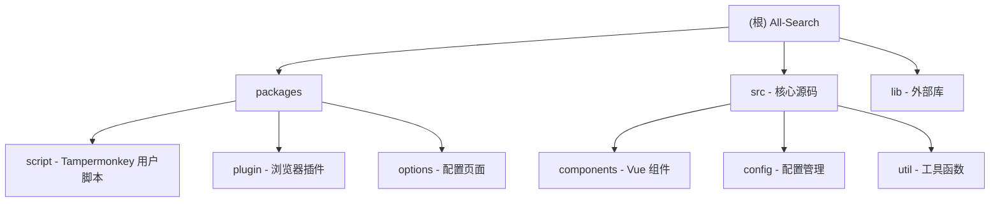

# All-Search 项目开发指南

## 变更记录 (Changelog)

### 2025-12-30 15:38:20 - AI 上下文二次增强
- 完成全仓扫描：识别 5 个模块，85 个关键文件
- 生成 `.claude/index.json` 扫描索引（包含覆盖率和缺口分析）
- 确认模块文档完整性：所有子模块已有 CLAUDE.md
- 扫描覆盖率：18.9%（450 个文件中的 85 个）
- 识别主要缺口：无测试、无 TypeScript、部分文档缺失

### 2025-12-30 14:24:51 - AI 上下文初始化
- 增强架构文档：添加 Mermaid 模块结构图
- 完善 Monorepo 结构说明
- 添加模块索引表格，包含各模块的一句话职责描述
- 为每个子模块生成独立的 `CLAUDE.md` 文档

---

## 项目概述

**All-Search (全搜)** 是一个基于Vue 3开发的搜索引擎跳转菜单工具，提供用户在不同搜索引擎之间快速切换的功能。项目支持多种部署形式，包括Tampermonkey用户脚本、浏览器插件等，是一个成熟的前端工具类项目。

## 🏗️ 项目架构

### 技术栈
- **Vue 3.3.4** - 前端框架（Composition API）
- **Vite 5.2.7** - 构建工具
- **Element Plus 2.2.22** - UI组件库
- **Vue Router 4.0.5** - 路由管理
- **Sass** - CSS预处理器
- **WXT 0.19.12** - 浏览器扩展开发框架
- **Rollup (via Vite)** - 模块打包

### 核心依赖
- `@floating-ui/vue` - 浮动定位（用于 Popper）
- `resize-observer-polyfill` - 响应式观察器
- `vite-plugin-monkey` - Tampermonkey 用户脚本开发支持

### Monorepo结构

项目采用 **pnpm workspace** 管理的 monorepo 架构：

```
all-search/
├── packages/
│   ├── script/         # Tampermonkey 用户脚本
│   ├── plugin/         # 浏览器插件（WXT 框架）
│   └── options/        # 配置页面（独立 Vue 应用）
├── src/                # 核心源码（共享代码库）
├── lib/                # 外部库文件（popper-lite）
└── 配置文件
```

### 模块结构图



## 📦 模块索引

| 模块路径 | 语言 | 职责描述 | 入口文件 | 相关脚本 |
|---------|------|---------|---------|---------|
| `packages/script` | JavaScript | Tampermonkey 用户脚本，通过 GM API 注入核心组件到网页 | `index.js` | `dev:script`, `build:script` |
| `packages/plugin` | JavaScript | 基于 WXT 的浏览器插件，支持 Chrome/Firefox 等 | `entries/content.js` | `dev:plugin`, `build:plugin` |
| `packages/options` | Vue 3 | 独立配置页面应用，提供搜索引擎和工具栏管理界面 | `main.js` | `dev:options`, `build:options` |
| `src` | Vue 3 | 核心共享代码库，包含所有组件、配置和工具函数 | `index.vue` | - |
| `lib` | JavaScript | 外部库文件（popper-lite.min.js） | - | - |

## 📁 目录结构详解

### 核心源码 (`src/`)

#### 组件系统 (`src/components/`)
- **基础UI组件**: `button.vue`, `dialog.vue`, `favicon.vue`, `logo.vue`, `icon.vue`, `radio.vue`, `color.vue`
- **功能组件**: `menu.vue`, `menuItem.vue`, `side-bar.vue`, `search-dialog.vue`, `version-alert.vue`
- **交互组件**: `hover-btn.vue`, `selection-bar.vue`, `popper.vue`, `overlay.vue`
- **滚动条组件**: `scrollbar/` - 自定义滚动条实现
- **逻辑组合 (Composables)**:
  - `useConfig.js` - 配置管理
  - `useSites.js` - 搜索引擎数据管理
  - `useToolbar.js` - 工具栏状态管理
  - `useMode.js` - 布局模式管理
  - `useSwitchShow.js` - 显示/隐藏切换
  - `useAlign.js` - 对齐方式
  - `useColor.js` - 颜色管理
  - `useFavicon.js` - 网站图标处理

#### 配置管理 (`src/config/`)
- `loadList.js` - 支持的网站加载列表（214+ 网站的 URL 匹配规则和特殊样式）
- `siteInfo.js` - 当前站点信息管理
- `toolbar.js` - 工具栏默认配置
- `sites/` - 各类搜索引擎配置目录
  - `index.js` - 搜索引擎分类索引（12 个分类）
  - `search.js` - 通用搜索引擎（百度、谷歌、必应等）
  - `image.js` - 图片搜索
  - `video.js` - 视频搜索
  - `music.js` - 音乐搜索
  - `translate.js` - 翻译工具
  - `scholar.js` - 学术搜索
  - `shopping.js` - 购物搜索
  - `developer.js` - 开发工具
  - `news.js` - 新闻搜索
  - `social.js` - 社交网络
  - `knowledge.js` - 百科知识
  - `disk.js` - 网盘搜索

#### 工具函数 (`src/util/`)
- **核心工具**: `index.js`, `storage.js`, `hook.js`, `store.js`
- **样式处理**: `initStyle.js`, `addSpecialStyle.js`, `injectStyle.js`
- **交互功能**: `getKeyword.js`, `fullScreen.js`, `clipboard.js`, `onClickOutside.js`, `tap.js`
- **兼容性**: `routerChange.js`, `addScript.js`, `sites.js`
- **性能优化**: `debounce.js`, `raf.js`, `useTimeout.js`, `useScroll.js`
- **URL 处理**: `parseUrl.js`

### 子包结构

#### 1. 用户脚本包 (`packages/script/`)
- 开发: `pnpm run dev:script`
- 构建: `pnpm run build:script`
- 入口: `packages/script/index.js`
- 配置: `packages/script/src/script-config.js` - Tampermonkey 元数据

**特点**：
- 使用 Vite + vite-plugin-monkey 构建
- 支持开发模式（watch）和生产模式
- 生成符合 Tampermonkey 规范的用户脚本
- 通过 GM API (`GM_getValue`, `GM_setValue`) 管理存储

#### 2. 浏览器插件包 (`packages/plugin/`)
- 开发: `pnpm run dev:plugin`
- 构建: `pnpm run build:plugin`
- 配置: `packages/plugin/wxt.config.js`
- 入口:
  - Content Script: `entries/content.js`
  - Options Page: `entries/options/main.js`

**特点**：
- 使用 WXT 框架开发
- 支持 Chrome、Firefox 多浏览器
- 自动生成 manifest.json
- 使用 `wxt/storage` API 管理存储
- 支持热重载

#### 3. 配置页面包 (`packages/options/`)
- 开发: `pnpm run dev:options`
- 构建: `pnpm run build:options`
- 入口: `packages/options/main.js`
- 路由: `packages/options/route/index.js`
- 页面组件: `packages/options/views/`
  - `config.vue` - 配置主页面
  - `sites.vue` - 搜索引擎配置
  - `edit.vue` - 编辑页面
  - `toolbar.vue` - 工具栏配置

**特点**：
- 独立的 Vue 3 + Vue Router 应用
- 使用 Element Plus 组件库
- 支持拖拽排序（vue-draggable-next）
- 可部署到 GitHub Pages

## 🚀 开发指南

### 环境准备
```bash
# 安装依赖
pnpm install

# 准备Git hooks
pnpm run prepare
```

**依赖要求**：
- Node.js: >= 16
- pnpm: >= 8

### 开发模式

#### 用户脚本开发
```bash
pnpm run dev:script
```
- 使用 watch 模式自动构建
- 生成 `index.dev.js` 文件
- 需要复制到 Tampermonkey 中运行
- 记得开启文件访问权限

**调试技巧**：
1. 在 Tampermonkey 中启用"允许访问文件网址"
2. 使用 `file://` 协议加载开发版本
3. 修改代码后自动重新构建

#### 浏览器插件开发
```bash
pnpm run dev:plugin
```
- 使用 WXT 框架进行开发
- 支持热重载
- 自动加载到浏览器

**Firefox 开发**：
```bash
pnpm run dev:firefox
```

#### 配置页面开发
```bash
pnpm run dev:options
```
- 独立的 Vue 应用
- 用于搜索引擎配置管理
- 访问 `http://localhost:5173/all-search/`

### 生产构建

#### 构建用户脚本
```bash
pnpm run build:script
```
- 生成 `dist/index.user.js`
- 版本号引用 package.json
- 可直接发布到 GreasyFork

#### 构建浏览器插件
```bash
pnpm run build:plugin
```
- 生成 zip 包
- 支持 Chrome、Firefox 等

**分浏览器构建**：
```bash
pnpm run build:firefox  # Firefox 专用
pnpm run zip            # 打包 Chrome 版本
pnpm run zip:firefox    # 打包 Firefox 版本
```

#### 构建配置页面
```bash
pnpm run build:options
```
- 生成静态文件到 `packages/options/dist/`
- 可部署到 GitHub Pages

## 🔧 核心功能模块

### 1. 搜索引擎管理
- **分类管理**: 支持 12 种搜索引擎分类
- **拖拽排序**: 可调整搜索引擎顺序
- **自定义添加**: 支持用户添加自定义搜索引擎
- **自动加载**: 新添加的搜索引擎自动显示
- **数据持久化**: 使用 localStorage (TM) 或 chrome.storage (Plugin)

### 2. 用户界面
- **响应式设计**: 支持桌面端和移动端
- **布局切换**: 支持水平/垂直布局
  - 水平：顶部/底部固定
  - 垂直：左侧/右侧固定
- **主题适配**: 自动适应网站样式
- **隐藏功能**: 支持自动隐藏和手动触发
- **动画效果**: 平滑的过渡动画

### 3. 交互功能
- **文本选择工具栏**: 选中文字后显示工具栏（可配置）
- **全局弹窗搜索**: 快速搜索功能
- **中键打开**: 支持中键打开新窗口
- **快捷键支持**: 键盘快捷键操作
- **触摸支持**: 移动端触摸手势

### 4. 兼容性处理
- **样式保护**: 使用 CSS 命名空间防止被网站样式覆盖
- **路由监听**: 适配 SPA 应用（监听 URL 变化）
- **DOM 劫持**: 针对特殊网站的处理（百度、YouTube 等）
- **特殊样式注入**: 针对 214+ 网站的样式适配

## 🎨 样式系统

### CSS 变量
```css
:root {
  --as-horizontal-height: 40px;
  --as-primary-color: #1890ff;
  --as-bg-color: #ffffff;
  --as-primary-text-color: #606266;
  --as-secondary-background-color: #f5f7fa;
  --as-border-color: #e8e8e8;
}
```

### 布局模式
- **水平布局**: 顶部/底部固定
  - `.as-horizontal.as-top` - 顶部
  - `.as-horizontal.as-bottom` - 底部
- **垂直布局**: 左侧/右侧固定
  - `.as-vertical.as-left` - 左侧
  - `.as-vertical.as-right` - 右侧
- **移动端适配**: 点击触发菜单

### 动画效果
- **平滑过渡**: transform 动画（0.1s）
- **渐显渐隐**: opacity 动画
- **滑动效果**: 位置变化动画
- **隐藏/显示**: translateY/translateX 100%

### 样式隔离
- 所有样式使用 `#all-search` 作为根选择器
- 使用 `as-` 前缀避免命名冲突
- 重要样式使用 `!important` 防止覆盖

## 🔌 配置系统

### 配置存储

**Tampermonkey 模式**：
- 使用 `GM_getValue` / `GM_setValue` / `GM_deleteValue`
- 存储在 Tampermonkey 的独立存储空间

**Plugin 模式**：
- 使用 `wxt/storage` API
- 底层使用 `chrome.storage.local`

**存储 Key 格式**：
- `all-search-{name}` - 统一前缀
- 例：`all-search-sites`, `all-search-config`

### 配置项
- **搜索引擎列表** (`sites`): 分类和 URL 配置
- **界面设置** (`config`): 布局、颜色、位置
- **功能开关** (`toolbar`): 各种功能的启用/禁用
- **快捷键设置**: 自定义快捷键

### 配置导入/导出
- 支持 JSON 格式导入导出
- 使用 JsonEditor 组件编辑

## 🧪 测试和调试

### 本地调试
1. 打开浏览器开发者工具
2. 使用 Vue DevTools 调试组件
3. 检查控制台错误信息
4. 验证样式兼容性

**调试技巧**：
- 在 `src/index.vue` 的 `setup()` 中添加 `console.log`
- 使用 Vue DevTools 查看响应式数据
- 检查 `#all-search` DOM 结构

### 兼容性测试
- **Chrome**: 最新版本
- **Firefox**: 最新版本
- **Safari**: 最新版本
- **Edge**: 最新版本

### 移动端测试
- **iOS Safari**: 测试触摸交互
- **Android Chrome**: 测试响应式布局
- **微信浏览器**: 测试特殊环境

### 网站兼容性测试
- 在 `src/config/loadList.js` 中查看支持的网站列表
- 测试特殊样式是否生效
- 验证关键词提取是否正确

## 📦 部署发布

### 用户脚本发布
1. 更新版本号（`package.json`）
2. 构建脚本文件：`pnpm run build:script`
3. 上传到 GreasyFork
4. 更新 GitHub Release

**GreasyFork 发布**：
- 使用 `dist/index.user.js`
- 更新说明中注明版本变更

### 浏览器插件发布
1. 构建插件包：`pnpm run build:plugin`
2. 提交到 Chrome Web Store
3. 提交到 Firefox Add-ons
4. 更新 GitHub Release

**注意事项**：
- Chrome Web Store 需要审核（1-3 天）
- Firefox Add-ons 需要代码审查

### 配置页面部署
1. 构建静态文件：`pnpm run build:options`
2. 部署到 GitHub Pages
3. 配置自定义域名（可选）
4. 更新 CDN 缓存

**GitHub Pages 部署**：
- 使用 `packages/options/dist/` 目录
- 配置 base URL 为 `/all-search/`

## 🤝 贡献指南

### 代码规范
- 使用 ESLint 检查代码：`pnpm run lint`
- 遵循 Vue 3 组合式 API 规范
- 使用 Prettier 格式化代码（可选）
- 遵循 Git 提交规范（Conventional Commits）

**Commit 规范**：
```
feat: 新功能
fix: 修复 bug
refactor: 重构
style: 样式调整
docs: 文档更新
chore: 构建/工具变更
```

**Husky 钩子**：
- `pre-commit`: 运行 lint-staged
- `commit-msg`: 检查提交信息格式

### 提交流程
1. Fork 项目
2. 创建功能分支
3. 提交代码变更
4. 创建 Pull Request
5. 代码审查和合并

### 问题反馈
- 使用 GitHub Issues 报告问题
- 提供详细的重现步骤
- 包含浏览器和环境信息
- 添加相关截图或录屏

## 📚 相关资源

### 官方文档
- [Vue 3文档](https://vuejs.org/)
- [Vite文档](https://vitejs.dev/)
- [Element Plus文档](https://element-plus.org/)
- [WXT文档](https://wxt.dev/)
- [Tampermonkey 文档](https://www.tampermonkey.net/documentation.php)

### 同类工具
- [搜索酱](https://greasyfork.org/zh-CN/scripts/445274-searchjumper) - 功能最全面
- [searchEngineJump](https://greasyfork.org/zh-CN/scripts/2739-search-enginejump) - 用户最多

### 社区交流
- [GitHub Issues](https://github.com/all-search/all-search/issues)
- [腾讯频道](https://pd.qq.com/s/2bmefcl98) - 频道号: pd15449687

## 🤖 AI 使用指引

### 项目特点提示
1. **Monorepo 架构**：修改代码时注意区分共享代码（`src/`）和模块代码（`packages/*/`）
2. **多目标构建**：同一份核心代码构建为用户脚本和浏览器插件两种形式
3. **存储抽象**：`src/util/storage.js` 提供了统一的存储接口，根据环境自动选择 GM API 或 chrome.storage
4. **样式隔离**：所有样式必须使用 `#all-search` 命名空间，避免污染宿主页面

### 常见任务
- **添加新搜索引擎**：修改 `src/config/sites/{category}.js`
- **修改布局样式**：修改 `src/index.vue` 和 `src/assets/common.scss`
- **添加新功能组件**：在 `src/components/` 中创建，并在 `src/index.vue` 中引用
- **适配新网站**：在 `src/config/loadList.js` 中添加匹配规则和特殊样式

### 调试建议
1. 使用 `dev:script` 模式开发核心功能（更快）
2. 使用 `dev:plugin` 模式测试插件特性
3. 使用 Vue DevTools 查看组件状态
4. 检查 `#all-search` 元素的样式是否被覆盖

### 文档位置
- 根级文档：`CLAUDE.md`（本文件）
- 模块文档：`packages/{module}/CLAUDE.md`
- 核心代码文档：`src/CLAUDE.md`
- 扫描索引：`.claude/index.json`

## 📊 扫描覆盖率与缺口分析

### 当前覆盖率
- 估算总文件数：约 450 个
- 已扫描关键文件：85 个
- 覆盖率：18.9%
- 已记录模块：5 个（全部文档化）

### 已识别缺口
1. **测试覆盖**：
   - 无单元测试（Vitest）
   - 无组件测试（@vue/test-utils）
   - 无 E2E 测试（Playwright/Cypress）

2. **类型安全**：
   - 无 TypeScript 类型定义（除 WXT 自动生成）
   - 建议逐步迁移到 TypeScript

3. **文档完善**：
   - 部分工具函数缺少 JSDoc 注释
   - 建议为每个公共 API 添加文档

4. **国际化**：
   - 无 i18n 支持
   - 仅支持中文界面

### 下一步建议
1. **优先级 1（质量）**：
   - 添加单元测试（Vitest + @vue/test-utils）
   - 为核心工具函数添加 JSDoc

2. **优先级 2（类型安全）**：
   - 逐步迁移到 TypeScript
   - 添加类型定义文件

3. **优先级 3（功能）**：
   - 添加国际化支持（vue-i18n）
   - 优化性能（虚拟滚动、懒加载）

4. **优先级 4（基础设施）**：
   - CI/CD 自动化（GitHub Actions）
   - 自动化发布流程

## 📄 许可证

本项目采用 [GPL-3.0](LICENSE) 许可证开源。

---

**注意**: 本项目为个人兴趣开发，用爱发电。如果觉得项目对您有帮助，欢迎给个⭐Star鼓励一下！
